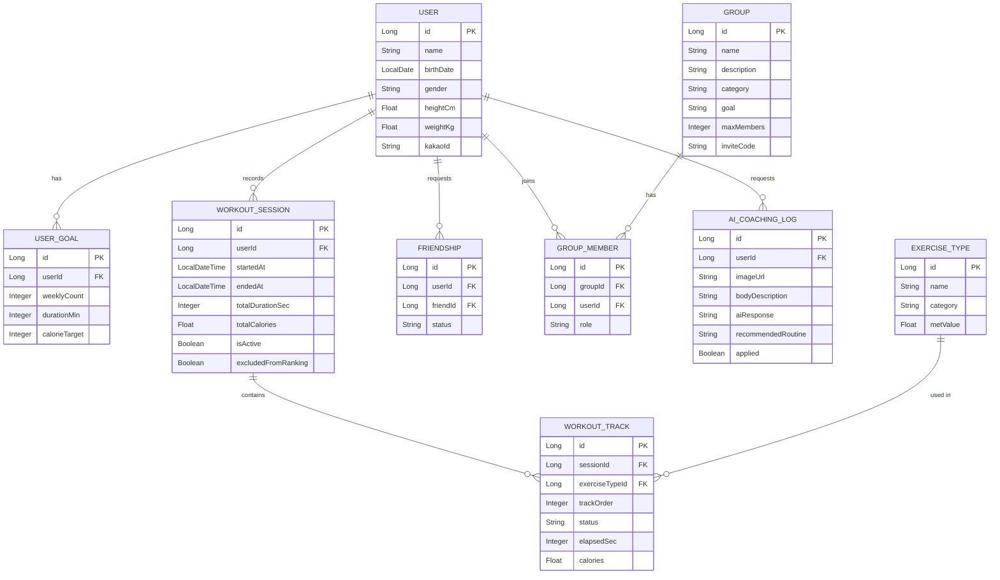

# 젤로 (Jello)

운동 기록 및 운동 그룹 매칭 어플입니다.

## GitHub 저장소

https://github.com/sooupyy3-lang/jello

---

## 개발 환경 정보

| 항목 | 내용 |
|---|---|
| Backend 언어/버전 | Java 17 |
| Backend 빌드 도구 | Gradle 8 (wrapper 포함, `./gradlew`) |
| Frontend 런타임 | Node.js + npm |
| Frontend 빌드 도구 | Vite 8 |
| Database | MySQL 8 |
| 컨테이너 | Docker (멀티스테이지 빌드, JDK 17 → JRE 17) |
| 환경 분리 | `application-local.yml` (로컬) / `application-prod.yml` (운영) |
| Frontend 배포 | Vercel |

---

## 개발 스택 정보

### Backend
- Spring Boot 3.5.13
- Spring Data JPA (Hibernate) + MySQL
- Spring Security + JWT (jjwt 0.11.5, HS256)
- Kakao OAuth 2.0 (소셜 로그인)
- OpenAI API 연동 (gpt-4.1-mini, AI 운동 코칭)
- Lombok, Jakarta Validation

### Frontend
- React 19 + Vite 8
- React Router DOM 7
- Pretendard 웹폰트
- ESLint 9

### Infra
- Docker
- MySQL 8

---

## ERD



상세 컬럼 명세는 [workout_app_schema.md](workout_app_schema.md) 참고 (일부 컬럼은 이후 리팩터링으로 변경됨 — 위 다이어그램이 최신 기준).

---

## 시작하기

### 1. MySQL 데이터베이스 생성
```sql
CREATE DATABASE dumbbell CHARACTER SET utf8mb4 COLLATE utf8mb4_unicode_ci;
```

### 2. application.yml 수정
```yaml
spring.datasource.password: 본인 MySQL 비밀번호
jwt.secret: 256비트 이상의 랜덤 문자열로 교체
```

### 3. 서버 실행
```bash
./gradlew bootRun
```
JPA `ddl-auto: update` 로 설정되어 있어 테이블이 자동 생성됩니다.

### 4. 시드 데이터 삽입
```bash
mysql -u root -p dumbbell < src/main/resources/seed.sql
```

---

## 프로젝트 구조

```
src/main/java/com/dumbbell/
├── DumbbellApplication.java
├── config/
│   ├── JwtUtil.java
│   └── SecurityConfig.java
├── controller/
│   ├── AuthController.java       # 회원가입 / 로그인 / 카카오 OAuth
│   ├── UserController.java       # 프로필 / 목표
│   ├── GroupController.java      # 그룹 생성·탐색·가입·관리
│   ├── FriendController.java     # 친구 요청·수락·목록
│   ├── WorkoutController.java    # 운동 세션 · 트랙 · 종류
│   ├── RankingController.java    # 랭킹(누적시간/목표달성/출석)
│   ├── AiCoachingController.java # AI 운동 코칭
│   └── StatsController.java      # 통계
├── service/
│   ├── UserService.java
│   ├── KakaoService.java
│   ├── GroupService.java
│   ├── FriendService.java
│   ├── WorkoutService.java
│   ├── AiCoachingService.java / OpenAiCoachingClient.java
│   └── StatsService.java
├── repository/                   # Spring Data JPA (도메인별 Repository)
├── entity/
│   ├── User.java / UserGoal.java
│   ├── Group.java / GroupMember.java
│   ├── Friendship.java
│   ├── ExerciseType.java / WorkoutSession.java / WorkoutTrack.java
│   └── AiCoachingLog.java
├── dto/                           # 요청/응답 DTO
└── exception/                     # GlobalExceptionHandler + 커스텀 예외
```

---

## API 명세

Swagger는 별도 도입하지 않았고, 아래 표로 전체 API를 정리했습니다.

### 인증 (토큰 불필요)

| Method | URL | 설명 |
|--------|-----|------|
| GET | `/api/auth/check-nickname?name=` | 닉네임 중복 확인 |
| POST | `/api/auth/register` | 회원가입 |
| POST | `/api/auth/login` | 로그인 |
| GET | `/api/auth/kakao/url?redirectUri=` | 카카오 로그인 URL 발급 |
| POST | `/api/auth/kakao/login?code=&redirectUri=` | 카카오 인가코드 → JWT 발급 |

**회원가입 요청 예시**
```json
{
  "name": "조서영",
  "birthDate": "2001-05-16",
  "gender": "female",
  "heightCm": 161,
  "weightKg": 58,
  "weeklyCount": 2,
  "durationMin": 60,
  "calorieTarget": 400
}
```

**응답**
```json
{
  "token": "eyJ...",
  "userId": 1,
  "name": "조서영"
}
```

---

### 이후 모든 요청 — Authorization 헤더 필요
```
Authorization: Bearer {token}
```

---

### 유저

| Method | URL | 설명 |
|--------|-----|------|
| GET | `/api/users/me` | 내 프로필 조회 |
| PUT | `/api/users/me` | 프로필/목표 수정 |

---

### 운동

| Method | URL | 설명 |
|--------|-----|------|
| GET | `/api/workouts/home` | 홈화면 데이터 |
| GET | `/api/exercises?category=헬스` | 운동 종류 목록 |
| GET | `/api/exercises/categories` | 운동 카테고리 목록 |
| POST | `/api/workouts/sessions` | 운동 세션 시작 |
| GET | `/api/workouts/sessions/today` | 오늘 세션 조회 |
| GET | `/api/workouts/sessions?date=2026-03-13` | 특정 날 기록 |
| PATCH | `/api/workouts/tracks/{trackId}` | 트랙 재생/일시정지 |
| POST | `/api/workouts/sessions/end` | 운동 종료 |

**세션 시작 요청 예시** (헬스 선택 → 상체 + 하체 두 트랙)
```json
{
  "exerciseTypeIds": [3, 4]
}
```

**트랙 상태 변경 예시** (일시정지)
```json
{
  "status": "paused",
  "elapsedSec": 1930
}
```

---

### 그룹

| Method | URL | 설명 |
|--------|-----|------|
| POST | `/api/groups` | 그룹 생성 (초대코드 자동 발급) |
| GET | `/api/groups?keyword=&sort=recent\|members` | 그룹 탐색(검색/정렬) |
| GET | `/api/groups/my` | 내 그룹 목록 |
| GET | `/api/groups/{groupId}` | 그룹 상세 조회 |
| PUT | `/api/groups/{groupId}` | 그룹 정보 수정 (방장만) |
| POST | `/api/groups/join?inviteCode=` | 초대코드로 가입 |
| POST | `/api/groups/{groupId}/join` | 탐색 목록에서 바로 가입 |
| DELETE | `/api/groups/{groupId}/leave` | 그룹 탈퇴 |
| DELETE | `/api/groups/{groupId}/members/{targetUserId}` | 멤버 내보내기 (방장만) |
| DELETE | `/api/groups/{groupId}` | 그룹 삭제 (방장만) |
| PATCH | `/api/groups/{groupId}/owner` | 방장 권한 위임 (방장만) |
| GET | `/api/groups/{groupId}/active` | 현재 운동 중인 그룹원 조회 |

- 초대코드는 그룹 생성 시 8자리 UUID로 자동 발급
- 방장 전용 액션(수정/삭제/강퇴/위임)은 서비스 레이어에서 role 검증 후 처리

---

### 친구

| Method | URL | 설명 |
|--------|-----|------|
| GET | `/api/friends` | 친구 목록 |
| GET | `/api/friends/active` | 현재 운동 중인 친구 목록 |
| GET | `/api/friends/requests` | 받은 친구 요청 목록 |
| POST | `/api/friends/by-nickname?nickname=` | 닉네임으로 친구 요청 |
| POST | `/api/friends/{targetId}` | userId로 친구 요청 |
| PATCH | `/api/friends/{requesterId}/accept` | 친구 요청 수락 |
| DELETE | `/api/friends/{targetId}` | 친구 삭제 / 요청 거절 |

---

### 랭킹 & 통계

| Method | URL | 설명 |
|--------|-----|------|
| GET | `/api/rankings?type=time\|goal\|attendance` | 오늘/목표달성/출석 기준 랭킹 |
| GET | `/api/stats/me` | 내 통계(주간 기록, 목표 달성률 등) 조회 |

- `type=time` : **오늘** 운동 시간 기준 (전체 누적 아님)
- `type=goal` : 목표 달성 횟수 기준 (전체 누적)
- `type=attendance` : 총 운동일수 기준 (전체 누적)
- 3시간 이상 지속된 비정상("좀비") 세션은 5분 주기 스케줄러가 자동 종료 처리하고 랭킹 집계에서 제외

---

### AI 운동 코칭

| Method | URL | 설명 |
|--------|-----|------|
| POST | `/api/ai/coaching` | 이미지(선택)+체형 설명 → AI 루틴 추천 (multipart/form-data) |
| GET | `/api/ai/coaching/latest` | 최근 코칭 결과 조회 |
| GET | `/api/ai/coaching/history` | 코칭 이력 전체 조회 |
| POST | `/api/ai/coaching/{logId}/apply` | 추천 루틴을 현재 적용 루틴으로 지정 |

- 이미지 + 텍스트 설명을 기반으로 OpenAI API(gpt-4.1-mini) 호출 후 추천 루틴 저장
- 응답은 `AiCoachingLog`에 이력으로 누적되며 이후 재조회 가능

---

## 칼로리 계산 방식

```
칼로리(kcal) = MET × 체중(kg) × 0.0175 × 시간(분)
```

- 트랙별 독립 계산 후 세션 합산
- 칼로리는 추정치임을 UI에 명시 (와이어프레임 반영)
